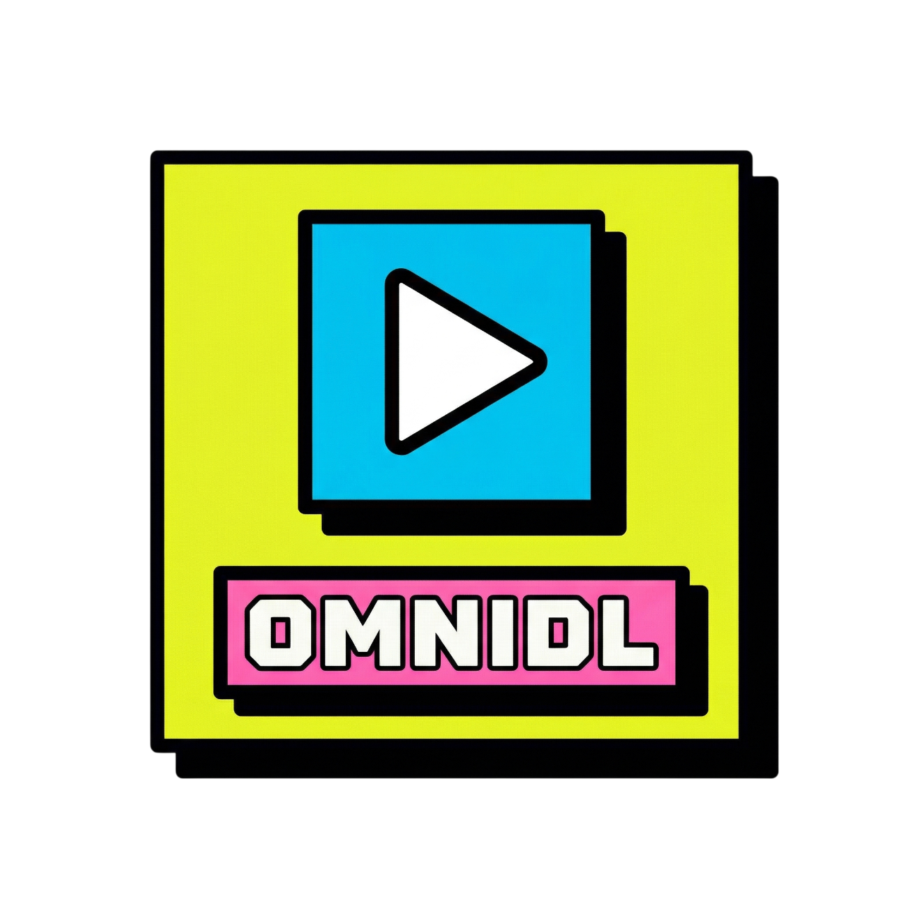

<div align="center">
 
<h1>OmniDL</h1>
<p>Desktop <strong>YouTube</strong> &amp; <strong>TikTok</strong> downloader for Windows — neo-brutalist UI, <strong>yt-dlp</strong> powered, local-first queue and history. Built with Electron, React, and TypeScript.</p>

<p>
 <a href="https://github.com/HyIsNoob/OmniDL"></a>
 <a href="https://github.com/HyIsNoob/OmniDL/releases"></a>
 
 
</p>
</div>

---

## Overview

OmniDL wraps **yt-dlp** and **FFmpeg** in a focused UI: paste a link, pick a format, enqueue downloads, and track progress in one place. Settings and history stay on disk (SQLite via **sql.js**). Optional **clipboard watch** fills the Home URL when you copy a supported link. Updates ship through **GitHub Releases** (electron-updater).

## Features

### Home

Paste a **YouTube** or **TikTok** video URL, run **Fetch** to load title, duration, and format ladder (with rough size hints). Choose **video** or **audio**, pick a quality preset, set output folder, then **Add to queue** (next or end). **Auto-fetch** (in Options) can run Fetch automatically when the URL field changes.


### Queue

Runs downloads **one at a time** with progress, speed, and ETA. **Pause**, **resume**, or **cancel** the active job; queued items wait in order. Uses **ffmpeg-static** for merge when needed.


### Playlist (YouTube)

Enter a **playlist** URL, set a **limit** (max entries), and **Get playlist** to list titles. Enqueue many items at once with your chosen default format mode (e.g. best video, 480p cap, best audio).


### History

Browse **past downloads**: titles, paths, and quick actions such as opening the output folder. Data is stored locally in the app user data directory.


### Options

Configure **download directory**, **clipboard detection** (YouTube / TikTok video links; playlist-only URLs are ignored for Home paste), **auto-fetch**, **yt-dlp** version check and update, and **application updates** from GitHub.


## Requirements

- **Windows** (current build targets NSIS installer + portable).
- [Node.js](https://nodejs.org/) 20+ to build from source.

## Install from a release

Download the installer or portable build from [Releases](https://github.com/HyIsNoob/OmniDL/releases).

## Build from source

```powershell
npm ci
npm run build
npm run dist
```

Output is written to `release/` (gitignored).

### Scripts

| Command | Description |
|---------|-------------|
| `npm run dev` | Dev mode (electron-vite) |
| `npm run build` | Build main, preload, and renderer |
| `npm run lint` | ESLint |
| `npm run dist` | Build + electron-builder (no publish) |
| `npm run release` | Build + publish to GitHub Releases (`GH_TOKEN` / CI) |

## Auto-update

`build.publish` in `package.json` points at GitHub. After a release is published, the app uses `electron-updater` against that feed. Code signing may be required for strict Windows SmartScreen policies depending on your environment.

## Disclaimer

OmniDL is intended for **personal, educational use only**. Users are responsible for complying with applicable **copyright laws** and the **Terms of Service** of any platform they access.

## License

MIT
