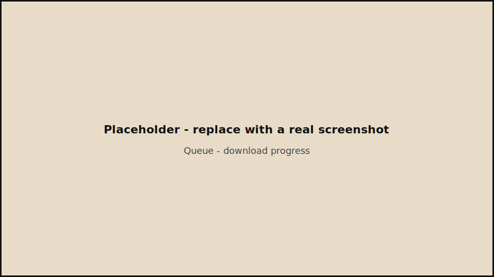
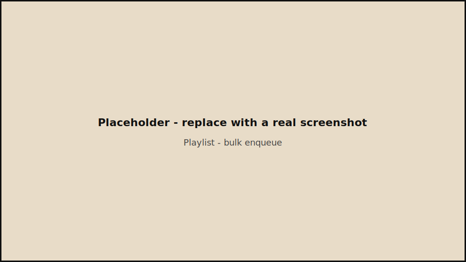
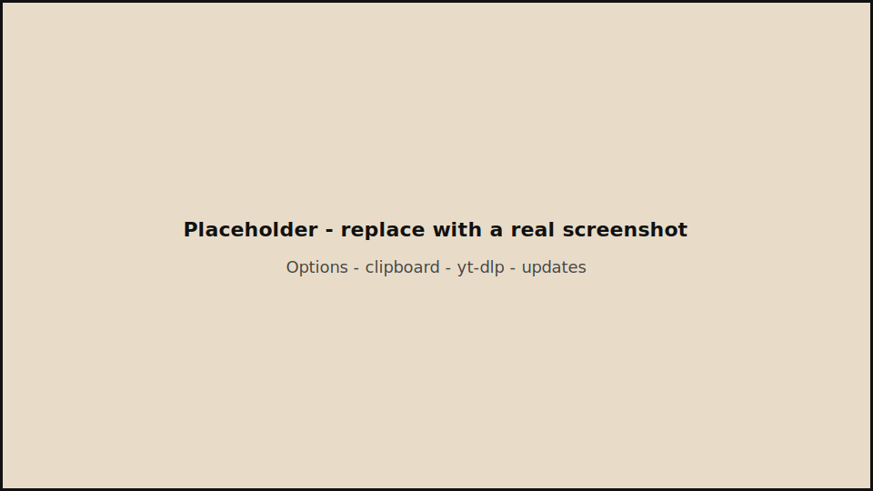

# OmniDL

Ứng dụng desktop (Electron) tải **YouTube** và **TikTok** với giao diện neo-brutalism: hàng đợi tuần tự, lựa chọn format, lịch sử (SQLite), clipboard detect, cập nhật **yt-dlp** và tích hợp cập nhật ứng dụng qua GitHub Releases.

## Ảnh màn hình (placeholder)

Chụp màn hình thật rồi thay các file SVG trong [`docs/screenshots/`](docs/screenshots/) bằng PNG/JPG cùng tên hoặc sửa đường dẫn dưới đây.

| Tab | Placeholder |
|-----|-------------|
| Home |  |
| Queue |  |
| Playlist |  |
| Options |  |

Khuyến nghị: ảnh ngang ~16:9 (ví dụ 1280×720).

## Tính năng chính

- **Home**: dán URL, Fetch metadata, chọn video/audio và format, thêm vào hàng đợi.
- **Queue**: tải tuần tự, tiến trình / tạm dừng / hủy; FFmpeg qua `ffmpeg-static`.
- **Playlist YouTube**: lấy danh sách và enqueue hàng loạt (giới hạn số mục).
- **History**: lịch sử đã tải (sql.js).
- **Options**: thư mục tải, clipboard watch, auto-fetch, kiểm tra / cập nhật yt-dlp, cập nhật ứng dụng (electron-updater).

## Yêu cầu

- **Windows** (bản build hiện tại nhắm NSIS + portable).
- [Node.js](https://nodejs.org/) 20+ để build từ mã nguồn.

## Cài đặt từ bản build

Tải file cài đặt hoặc portable từ [Releases](https://github.com/HyIsNoob/OmniDL/releases).

## Build từ mã nguồn

```powershell
npm ci
npm run build
npm run dist
```

- Artefact nằm trong thư mục `release/` (bị gitignore).
- Build công khai lên GitHub: xem mục **Release bằng GitHub Actions** bên dưới.

### Script

| Lệnh | Mô tả |
|------|--------|
| `npm run dev` | Chạy dev (electron-vite) |
| `npm run build` | Build main + preload + renderer |
| `npm run lint` | ESLint |
| `npm run dist` | Build + electron-builder (không publish) |
| `npm run release` | Build + đẩy bản lên GitHub Releases (cần `GH_TOKEN` / CI) |

## Release bằng GitHub Actions

1. Cập nhật `version` trong `package.json` trước mỗi release (và `repository` / `build.publish` nếu đổi repo).
2. Tạo tag và đẩy:

```powershell
git add -A
git commit -m "Release v1.0.0"
git tag v1.0.0
git push origin main
git push origin v1.0.0
```

Workflow **Release** (`.github/workflows/release.yml`) chạy trên Windows, build installer + portable và đăng kèm GitHub Release.

Workflow **CI** (`.github/workflows/ci.yml`) chạy lint + build trên mỗi push/PR.

## Cấu hình auto-update

Trong `package.json`, `build.publish` trỏ tới GitHub. Sau khi có release, client gọi `electron-updater` với feed tương ứng repo (cần ký mã nếu bật strict trên Windows — tùy môi trường).

## License

MIT
